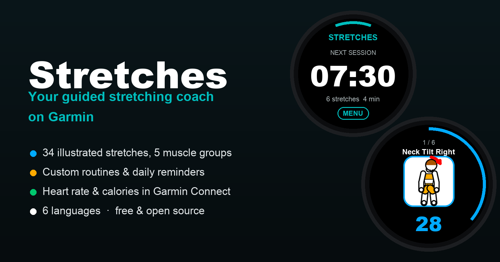
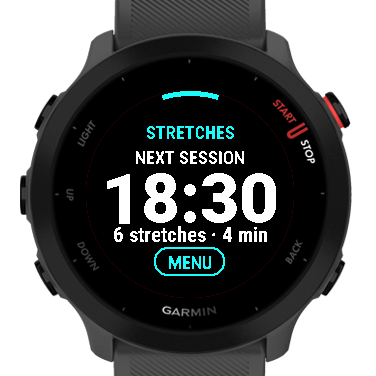
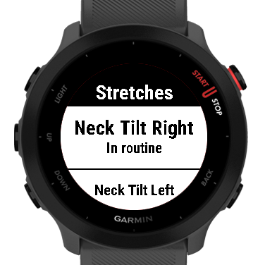
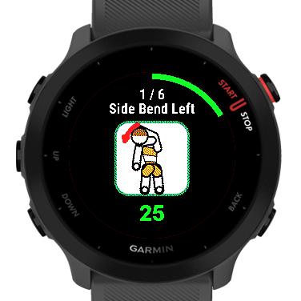
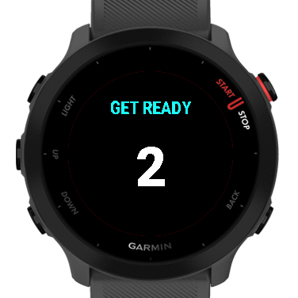
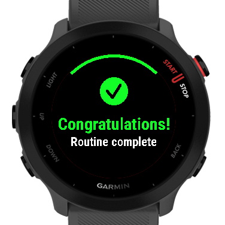
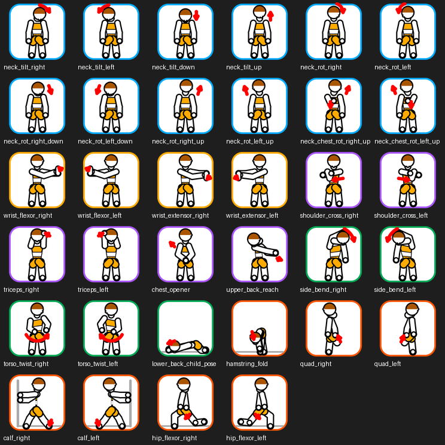
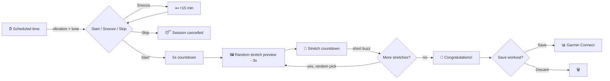

<div align="center">


# 🤸 Stretches

**A colorful stretching-routine coach for Garmin watches.**

Build your own routine, get reminded at the times you choose, follow guided
illustrated stretches, and save every session to Garmin Connect.

[](../../actions/workflows/ci.yml)
[](../../releases)
[](LICENSE)
[](https://developer.garmin.com/connect-iq/)
[](#-supported-devices)
[](#-languages)



</div>

---

## 📷 Screenshots

<div align="center">

| Home | My stretches | Guided stretch | Get ready | Done! |
|:---:|:---:|:---:|:---:|:---:|
|  |  |  |  |  |

<sub>Captured on the Forerunner 55 simulator. Live heart rate appears during the stretch on a watch with a HR sensor.</sub>

</div>

## ✨ Features

- 🧘 **34 stretches** across neck, wrist/forearm, shoulder/chest, torso/back
  and legs — including twelve dedicated neck positions (tilts, turns and
  combined turn+tilt holds).
- 🎨 **Illustrated guidance**: each stretch shows a clear drawing with a
  motion arrow, color-coded by muscle group.
- 🛠 **Your routine, your rules**: pick any set of stretches and give each
  one its own duration (default 30 s).
- ⏰ **Daily schedules**: add as many alarm times as you want and toggle each
  one on/off individually.
- 📳 **Smart reminders**: at the scheduled time the watch vibrates and beeps,
  then asks — **Start** · **Snooze 15 min** · **Skip**.
- 🚦 **Guided flow**: 5-second countdown → stretch preview with a 3-second
  lead-in → live countdown with progress ring → short buzz between
  stretches → 🎉 congratulations screen.
- ⏯ **Full control mid-workout**: pause (START), skip a stretch (DOWN) or
  end early (BACK, with confirmation).
- ❤️ **Real activity recording**: sessions are saved as *Flexibility
  Training* with heart rate, calories and time, one lap per stretch, plus a
  custom *stretches completed* FIT field — all visible in Garmin Connect.
- 🌍 **6 languages** following the watch system language: English,
  Português, Español, Français, Deutsch, Italiano.
- 🔋 **Battery-friendly**: reminders use Connect IQ background temporal
  events; nothing runs while you are not stretching.

## 🖼 The stretch library

<div align="center">


*34 stretches · 5 muscle groups · hand-crafted figures rendered per screen
size, from the 208×208 Forerunner 55 to the 416×416 Venu 2.*
</div>

## 🎬 How a session works



Stretches are shuffled every session, so routines never feel repetitive.

## 📱 Using the app

| Screen | Keys |
|---|---|
| Home | **START** opens the menu |
| Menu | *Start now*, *My stretches*, *Durations*, *Schedules*, *Settings*, *About* |
| My stretches | List of all 34 stretches; tap to add/remove from your routine |
| Durations | Per-stretch seconds picker (5–300 s, default 30 s) |
| Schedules | Add times, then per-time: *Enabled*, *Edit time*, *Delete* |
| Workout | **START** pause/resume · **DOWN** skip · **BACK** end early |

> [!NOTE]
> Reminders use Connect IQ *background temporal events*: the watch wakes the
> app with a confirmation prompt at the scheduled time. Garmin fires these
> with up-to-5-minute granularity and may delay them during an ongoing
> activity — the app clamps and re-registers automatically, and also
> triggers instantly when it is already open.

## ⌚ Supported devices

Forerunner 55 (the reference device), Forerunner 245/255/745/945/955 series,
Fēnix 6/7 series, Venu / Venu 2 / Venu Sq series, Vívoactive 4 — 28 models
total, Connect IQ API ≥ 3.2.

<details>
<summary>Full device list</summary>

`fr55` `fr245` `fr245m` `fr255` `fr255m` `fr255s` `fr255sm` `fr745` `fr945`
`fr955` `fenix6` `fenix6pro` `fenix6s` `fenix6spro` `fenix6xpro` `fenix7`
`fenix7s` `fenix7x` `venu` `venu2` `venu2plus` `venu2s` `venusq` `venusqm`
`venusq2` `venusq2m` `vivoactive4` `vivoactive4s`

</details>

## 🌍 Languages

| | Language | |
|---|---|---|
| 🇺🇸 | English | default |
| 🇧🇷 | Português | |
| 🇪🇸 | Español | |
| 🇫🇷 | Français | |
| 🇩🇪 | Deutsch | |
| 🇮🇹 | Italiano | |

The app follows the watch system language automatically. Adding a language
is a single XML file — see [CONTRIBUTING.md](CONTRIBUTING.md).

## 🚀 Getting started (developers)

```bash
# 1. Connect IQ SDK + device files (needs a free Garmin account)
connect-iq-sdk-manager agreement view          # note the hash
connect-iq-sdk-manager agreement accept --agreement-hash <HASH>
connect-iq-sdk-manager login
connect-iq-sdk-manager sdk set 9.2.0
connect-iq-sdk-manager device download --include-fonts --manifest manifest.xml
export PATH="$(connect-iq-sdk-manager sdk current-path --bin):$PATH"

# 2. Build & test
make key        # one-time signing key
make build      # compile for the Forerunner 55 (DEVICE=fr955 make build, etc.)
make sim        # launch the simulator
make test       # run the unit-test suite on the simulator
monkeydo bin/Stretches-fr55.prg fr55   # run the app in the simulator
```

To try it on a real watch, copy `bin/Stretches-fr55.prg` into the
`GARMIN/Apps` folder of the watch over USB.

### Project layout

```
stretches/
├── manifest.xml             # app id, devices, permissions, languages
├── monkey.jungle            # build configuration
├── source/
│   ├── StretchesApp.mc      # app entry + background service
│   ├── model/               # catalog, storage, scheduling math
│   ├── engine/              # WorkoutEngine — pure, unit-tested state machine
│   ├── session/             # activity recording (FIT)
│   ├── ui/                  # views, menus, theme
│   └── tests/               # Run No Evil unit tests
├── resources*/              # launcher icon + per-language strings
├── assets/illus<size>/      # stretch illustrations, one PNG set per screen size
├── scripts/                 # illustration generator (Python + Pillow)
└── .github/workflows/       # CI (build + tests) and release packaging
```

### Quality gates

Every PR runs through CI:

| Gate | What it checks |
|---|---|
| 🧾 XML validation | Manifest and all resources parse |
| 🌐 String sync | Every language ships every string id |
| 🖼 Illustration coverage | Every catalog entry has an image |
| 🛠 Compile | Type-check level 2, warnings enabled, zero errors |
| ✅ Unit tests | Scheduler math, workout engine, catalog integrity |

## 🤝 Contributing

Contributions are very welcome — new stretches, new languages, new devices,
bug fixes. Start with [CONTRIBUTING.md](CONTRIBUTING.md); adding a stretch
is a ~4-step change with a friendly checklist.

## 📦 Releasing

Tag `v*` → CI builds and attaches the store-ready `Stretches.iq` to a GitHub
release, ready to upload to the
[Connect IQ store dashboard](https://apps.garmin.com/developer/dashboard).
Ready-to-paste store copy lives in [docs/STORE_LISTING.md](docs/STORE_LISTING.md).

## 📄 License

[MIT](LICENSE) — free to use, modify and distribute. If this app keeps your
neck happy, a ⭐ on the repo makes ours happy too.
